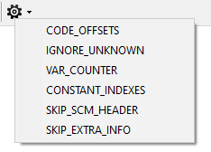

# Console

The **console** offers an ability to switch debug options of Sanny Builder. Mostly they relate to the disassembler features and you can see the changes when disassemble a file. The console window is open after pressing `Ctrl+~`. You may enter the commands in the input line. After typing a command press  `Enter` to proceed. The console will display a result.

## Available commands 

All commands are case-insensitive.

`help` – shows the help information about the console  
`clear` – clears the console  
`list` – shows in the console the list of all commands  
`list options` – lists all available debug options  
`toggle [on/off]` – enable or disable [debug options](console.md#debug-options)

The input command ends either with the word `ON` \(the option will be enabled\) or `OFF` \(the option will be disabled\), or nothing \(the option will be toggled from `ON` to `OFF` or from `OFF` to `ON`\).


Before enabling the following options turn on the debug mode with the command `toggle debug_mode ON`


## Debug Options

### CODE\_OFFSETS

The disassembler prints the offset of each command.

### VAR\_COUNTER

After compiling the console contains the list of the [global variables](coding/variables.md#global-variables) used only once in the code \(i.e. can be removed or replaced with [local variables](coding/variables.md#local-variables)\).

### IGNORE\_UNKNOWN

The disassembler ignores unknown opcodes, incorrect parameters and so on. It helps to open almost any file that used to be protected or compiled incorrectly.

### CONSTANT\_INDEXES

The disassembler prints array elements as global variables with indexes. It's available for `GTA SA`, `LCS`, `VCS` games.

E.g. given an array of three elements starting at `$10` this option affects the way the variables look like after disassembling:

| Without `CONSTANT_INDEXES` | With `CONSTANT_INDEXES` |
| :--- | :--- |
| $10 | $10\[0\] |
| $11 | $10\[1\] |
| $12 | $10\[2\] |

### SKIP\_SCM\_HEADER

Disassembler skips the header of the input file. It allows to open headless scripts \(e.g. the ones from `script.img` or CLEO scripts\). 

With this option the compiler makes `.scm` files without the header \(similar to `{$EXTERNAL}` [directive](coding/directives.md#usdexternal)\).

### SKIP\_EXTRA\_INFO

The disassembler ignores the [extra info](options/general.md#add-extra-info-to-scm) section attached to the input file. It also treats this section as a set of regular SCM instructions, so enabling `IGNORE_UNKNOWN` option is recommended.

## Alternate ways

Sanny Builder offers a few other ways to toggling debug options outside of the console that might be useful in some cases.

### Running with --debug

The `--debug` [option](cli.md#debug) provides an alternate way of switching the debug options. Run Sanny with the parameter `--debug X`, where `X` is a series of `0` and `1`.  Each digit in the series corresponds to a particular debug option:

| Index | Debug Option |
| :--- | :--- |
| 1 | CODE\_OFFSETS |
| 2 | IGNORE\_UNKNOWN |
| 3 | VAR\_COUNTER |
| 4 | CONSTANT\_INDEXES |
| 5 | SKIP\_SCM\_HEADER |
| 6 | SKIP\_EXTRA\_INFO |

```text
sanny.exe --debug 110000
```

The first `1` enables the `CODE_OFFSETS` option, the second `1` enables the `IGNORE_UNKNOWN` mode. The remaining options are disabled.

### Using GUI

Clicking the right-most button in the main toolbar shows a drop-down menu with the list of debug options.



Each menu item toggles a particular debug option. The change comes into effect immediately.

