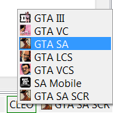

# Режимы редактирования

Sanny Builder поддерживает разные игры и платформы в серии Grand Theft Auto. Для этого в его состав входит конфигурация для каждой поддерживаемой игры, которая называется **режимом редактирования**.

Режим редактирования определяет следующую информацию:

* целевая игра
* пути к игровым файлам
* пути к файлам со вспомогательной информацией \(имена [меток](./#labels), [переменных](./#variables), [констант](./#constants)\)

По умолчанию Sanny Builder читает конфигурацию режимов из файла `<SB>\data\modes.xml`. Этот путь может быть изменен через [опцию](../cli.md#x) командной строки `-x`.

Допускается изменение существующих режимов и создание новых путем внесения изменений в файл `modes.xml`.

## Формат файла

`modes.xml` - документ в формате `XML`, который может редактироваться в любом текстовом редакторе. В этом файле содержатся все доступные режимы.

Корневым является элемент `<modes>`, который не имеет атрибутов. В файле может быть только один корневой элемент. 

Каждый из режимов описывается одним из дочерних элементов `<modes>`, начинающихся с открывающего тэга `<mode>` и заканчивающихся закрывающим тэгом `</mode>`. Элемент `<mode>` имеет как обязательные, так и необязательные атрибуты, описанные ниже. Содержимое `<mode>` представляет собой набор различных тэгов \(элементов\), определяющих пути к папкам и файлам.

### Атрибуты режима

#### id

`id` - это обязательный и неповторяющийся идентификатор режима. Sanny Builder использует его для сохранения некоторых пользовательских настроек режима, например выбранной [директории игры](../options/general.md#direktoriya-igry).

Допустимым значением атрибута является последовательность символов, которая не используется как идентификатор другого режима редактирования.

#### extends

Режим может наследовать свойства другого режима \(родительский режим\), чтобы уменьшить число повторяющихся параметров. Это полезно для разных версий одной игры, где большая часть конфигурации одинакова, за исключением некоторых параметров. Родительский режим может наследовать свойства другого режима.

Если в конфигурации режима отсутствует какой-то параметр, Sanny Builder рекурсивно проходит по всем родительским режимам, чтобы найти его значение.

Допустимым значением атрибута является идентификатор другого режима редактирования, описанного в этом же файле.

#### title

`title` задает отображаемое имя режима. Из-за ограничений интерфейса избегайте длинных имен и используйте имена короче `24` символов.

#### game

Атрибут `game` определяет целевую игру для данного режима. Допустимыми значениями являются:

* `gta3`
* `vc`
* `sa`
* `lcs`
* `vcs`
* `vc_mobile`
* `sa_mobile`

Перед началом работы со скриптом, убедитесь что выбран правильный режим редактирования. Каждая игра имеет свой собственный формат скриптов, который несовместим с другими играми. Даже если компиляция прошла без ошибок, в игре может возникнуть ошибка при попытке чтения скрипта в неизвестном ей формате.


В скомпилированном файле может [храниться информация](../options/general.md#dobavlyat-dopolnitelnuyu-informaciyu-v-scm) о целевой игре для данного скрипта. Перед началом дизассемблирования такого скрипта Sanny Builder предлагает переключить режим редактирования на нужный. Игнорирование такого предложения может привести к ошибке, т.к. формат скрипта может отличаться от того, что ожидает дизассемблер.


Для удобства пользователей Sanny Builder отображает иконку целевой игры напротив имени режима. 

#### type

Один из режимов для каждой целевой игры должен быть режимом по умолчанию. Это означает, что Sanny Builder использует его при запуске с [опцией](../cli.md#game) `--game`.

Допустимым значением атрибута является `default.` Не указывайте этот атрибут для остальных режимов.

### Параметры режима

#### arrays

путь к [`CustomArrays.ini`](../coding/arrays.md)

#### classes

путь к [`classes.db`](../coding/classes.md)

#### constants

путь к[`constants.txt`](../coding/constants.md)

#### copy-directory <a id="copy-directory"></a>

путь к директории, в которую нужно скопировать скрипт при запуске `Компилировать и сделать копию`:

Имеет обязательный атрибут `type`:  
`type="scm"` - применяется к обычным `.scm` скриптам `type="cleo"` - применяется к скриптам с [директивой](../coding/directives.md#usdcleo)  `{$CLEO}`

#### data

путь к директории режима редактирования

**enums**

путь к [enums.txt](enums.txt.md)

#### ide

путь к `.ide` или `.dat` файлу:  
`.ide` файлы содержат [имена моделей](../coding/data-types.md#imena-modelei) и их характеристики  
`.dat` файлы содержат пути к другим `.ide` файлам

Элемент `ide` имеет необязательный атрибут `base`, который задает папку, относительно которой расчитываются пути, определенные внутри `.dat` файла:

```text
<ide base="@game:\">default.dat</ide>
```

Без `base` все пути расчитываются относительно папки с `.dat` файлом.

Режим редактирования может иметь несколько элементов `<ide>`.

#### keywords

путь к файлу со списком [ключевых слов](../coding/keywords.md)

#### labels

путь к [`CustomLabels.ini`](customlabels.ini.md)

#### missions

путь к [`missions.txt`](../features.md#ispolzovanie-originalnykh-imen-missii)

#### opcodes

путь к файлу со [списком опкодов](opcodes-list-scm.ini.md)

#### templates

путь к файлу с [эксклюзивными шаблонами](code-templates.md)

#### text

путь к `.gxt` файлу

`<text>` имеет обязательный атрибут: `format`. Допустимыми значениями являются:

`gta3`: `.gxt` с одной таблицей, текстовыми ключами, кодировкой ANSI  
`vc`: `.gxt` с несколькими таблицами, текстовыми ключами, кодировкой ANSI  
`sa`: `.gxt` с несколькими таблицами, зашифрованными ключами, кодировкой ANSI  
`sa_mobile`: `.gxt` с несколькими таблицами, зашифрованными ключами, кодировкой UTF-16

#### variables

путь к [`CustomVariables.ini`](../coding/variables.md)

#### examples

путь к [`opcodes.txt`](../opcode-search-tool.md)

### Доступные переменные

Sanny предоставляет несколько переменных, которые могут использоваться в параметрах и атрибутах \(там, где это применимо\).

`@game:` - путь к [папке с игрой](../options/general.md#direktoriya-igry), которая выбрана в настройках  
`@sb:` - путь к папке Sanny Builder \(где находится `sanny.exe`\)

Оба пути не включают в себя завершающий слеш \(`/`\).

## Список режимов

Sanny Builder предлагает много различных режимов, их количество может меняться от версии к версии:

| Название | Имена опкодов | Порядок параметров | Игра |
| :--- | :--- | :--- | :--- |
| GTA III | сообщество | измененный | все версии GTA III |
| GTA VC | сообщество | измененный | все версии Vice City |
| GTA SA v1.0 | сообщество | измененный | SA версия 1.0  |
| GTA SA v2.0 | сообщество | измененный | SA версия 2.0 |
| GTA SA \(v1.0 - SCR\) | Rockstar | первоначальный | SA версия 1.0 |
| GTA LCS | Rockstar | первоначальный | все версии Liberty City Stories |
| GTA VCS \(PSP\) | Rockstar | первоначальный | VCS для PSP |
| GTA VCS \(PS2\) | Rockstar | первоначальный | VCS для PS2 |
| VC Mobile | сообщество | измененный | версия для Android и iOS |
| SA Mobile | сообщество | измененный | версия для Android и iOS |

Колонка `Имена опкодов` определяет способ именования опкодов. Первые имена неизвестным опкодам были даны в результате анализа игрового кода, проводимого сообществом скриптеров в течение многих лет. Так появились такие термины как "актёр" \("actor"\) или "поток" \("thread"\). Альтернативой является оригинальная терминология, использованная разработчиками игры \(соответственно, "персонаж" \("char"\) или "скрипт" \("script"\)\). Эта терминология вместе со списком оригинальных названий всех опкодов оказались доступны в коде игры GTA SA: Mobile.   

`Порядок параметров` определяет как расположены параметры опкода относительно друг друга. В первоначальном порядке все параметры находятся в той последовательности, как было задумано разработчиками игры, от параметра с наименьшим индексом к параметру с наибольшим индексом. Измененный порядок подразумевает, что в некоторых опкодах параметры переставлены местами для повышения читаемости кода или по иным причинам.

Сочетание оригинальной терминологии и сохранение порядка следования параметров обеспечивает максимальное сходство скриптов с тем языком, который использовали разработчики игры.

## Переключение режимов

Чтобы переключить режим редактирования, кликните в правом нижнем углу программы. Появится список доступных режимов. Выберите нужный и кликните по нему. Sanny Builder загрузит все требуемые файлы и вы сразу можете продолжить работу.



Выбрать режим через командную строку можно с [опцией](../cli.md#mode) `--mode`. Чтобы выбрать режим по умолчанию для какой-либо игры, используйте [опцию](../cli.md#game) `--game`.

Запуск Sanny Builder с [опцией](../cli.md#x) `-x` позволяет загрузить конфигурацию режимов из файла, отличного от `modes.xml`. Если при этом Sanny Builder уже запущен, он перезагрузит конфигурацию и обновит список доступных режимов.

