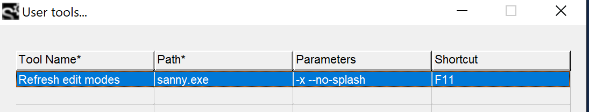

# Edit Modes

Sanny Builder supports many games and platforms and so there is a predefined configuration for each supported game called an **edit mode**.&#x20;

Edit modes supply Sanny Builder with the following information:

* a target game
* paths to files with the game data
* paths to files with supporting information ([labels](customlabels.ini.md), [variables](./#variables), [constants](./#constants), etc)

Sanny Builder stores the edit modes within the `data` folder. When a subfolder inside `data` contains a file named `mode.xml`, this file is automatically loaded as the configuration file for the respective edit mode.


In versions prior to 3.9, the modes configuration was stored in a single file named `modes.xml,` which was located in the `data` folder. Starting from version 3.9 and onwards, this configuration has been divided into separate XML files, each dedicated to a specific mode.


The modes configuration is automatically loaded upon startup of Sanny Builder. If needed, it can also be manually reloaded by running Sanny Builder with the `-x` CLI [option](../editor/cli.md#x).

The configuration of the modes is open to modification and extensions, and users can create their own modes for specific needs.

## File Format

The `mode.xml` file is formatted in XML and is editable using any text editor.

Each configuration file should begin with the following XML declaration:

```xml
<?xml version="1.0" encoding="UTF-8"?>
```

Following the declaration, there should be a single root node, `<mode>`. The file must only contain one root node.

Within the `<mode>` tag, there are both mandatory and optional attributes, as described below. The content of the `<mode>` tag consists of specific tags (properties) that define paths to directories or files.

### Mode Attributes

#### id

`id` is a required and unique identifier of the mode. Sanny Builder uses the `id` to save some user settings for this mode, e.g. a [game directory](../editor/options/general.md#game-directory).

A valid value for this attribute is a unique series of characters not used for any other mode's id.&#x20;

#### extends

A mode can extend another mode (a parent mode) to reduce a number of duplicated properties. It is helpful for different versions of the game where most of the configuration is the same except for a few properties. By extending another mode the mode inherits all its unique properties and can override them with the new values.

The parent can also extend another mode.

A valid value for this attribute is an `id` of another mode.

#### title

`title` defines the mode's displayed name. Due to the interface constraints avoid long names and keep it within the limit of `24` characters.

#### game

The `game` attribute defines a target game for the mode. There are `6` valid values:

* `gta3`
* `vc`
* `sa`
* `lcs`
* `vcs`
* `vc_mobile`
* `sa_mobile`

Before disassembling or compiling a script, make sure that the correct edit mode is active. Each game has an unique script format and the scripts compiled for one game are not compatible with scripts for another game. Even if the script is compiled without errors, the game would crash trying to read a script in different format.&#x20;


A compiled script file may [store information](../editor/options/general.md#add-extra-info-to-scm) about which game it is made for. When you open such a script, Sanny Builder prompts you to change the mode to the correct one. Ignoring this prompt may cause a crash of the disassembler, because the script format is unexpected for it.


Sanny Builder displays a game icon in front of the edit mode name so you know the target game.&#x20;

#### type

One mode for each target game must be a default one. It means Sanny Builder uses this mode when run with the `--game` CLI [option](../editor/cli.md#game).

The valid value for this attribute is `default.` Omit this attribute for non-default modes.

### Mode Parameters

#### arrays&#x20;

path to [`CustomArrays.ini`](../language/data-types/arrays.md)

#### copy-directory

path to a directory where to put a compiled script on `Compile + Copy` run.

Has a required attribute `type`:\
`type="scm"` - used for regular `.scm` scripts\
`type="cleo"` - used for scripts with [directive](../language/directives.md#usdcleo) `{$CLEO}`

#### classes&#x20;

path to[`classes.db`](../language/instructions/classes.md)

#### constants

path to[`constants.txt`](../language/data-types/constants.md)

#### data&#x20;

path to the mode directory

**enums**

path to [enums.txt](enums.txt.md)

#### ide&#x20;

path to either an `.ide` or `.dat` file:\
`.ide` files contain game [model names](../language/data-types/#model-names) and characteristics\
`.dat` files contain paths to other `.ide` files

`ide` element may have an optional `base` attribute to specify a folder that is used to resolve relative paths in the `.dat` file.

```xml
<ide base="@game:\">default.dat</ide>
```

Without `base` all relative paths are resolved starting from the location of the `.dat` file.

A mode may have multiple `<ide>` elements.

#### keywords&#x20;

path to a list of [keywords](../language/instructions/keywords.md)

#### labels&#x20;

path to [`CustomLabels.ini`](customlabels.ini.md)

#### missions&#x20;

path to[`missions.txt`](../editor/features.md#custom-mission-titles)

#### `library`

path to a JSON file with scripting command definitions used in the target [game](./#game). Available for download in [Sanny Builder Library](../editor/features.md#integration-with-sanny-builder-library).

#### opcodes&#x20;

path to a file with [opcodes](opcodes-list-scm.ini.md). Can be used multiple times with different files. This file is optional if you have specified a **library** path (see above).

#### templates&#x20;

path to a file with the mode's [exclusive templates](code-templates.md)&#x20;

Has a required attribute `type`:\
`type="default"` - path to the predefined templates shipped with Sanny Builder\
`type="custom"` - path to a file with user templates added via the [Add Template](code-templates.md#adding-a-new-template) form. This file is never overwritten during a Sanny Builder update.

#### text&#x20;

path to a `.gxt` file

`<text>` has one required attribute: `format`. The supported values are:

`gta3`: `.gxt` has one table, plain keys, ANSI encoding\
`vc`: `.gxt` has multiple tables, plain keys, ANSI encoding\
`sa`: `.gxt` has multiple tables, hashed keys, ANSI encoding\
`sa_mobile`: `.gxt` has multiple tables, hashed keys, UTF-16 encoding

#### variables

path to [`CustomVariables.ini`](../language/data-types/variables.md)

#### examples

path to [`opcodes.txt`](../editor/opcode-search-tool.md)


### Built-in Variables

Sanny provides a few variables that can be used in parameters and attributes (if applicable).

`@game:` - path to the [game directory](../editor/options/general.md#game-directory) configured in the options\
`@sb:` - path to the Sanny Builder directory (where `sanny.exe` is located)

Both paths do not include the trailing slash.

## Available Modes

Sanny Builder offers many different modes, and their number may vary from version to version:

<table data-header-hidden><thead><tr><th>Title</th><th width="106">Id</th><th width="165">Naming Schema </th><th width="154">Param Order</th><th>Game</th></tr></thead><tbody><tr><td>Title</td><td>Id</td><td>Naming schema </td><td>Parameters order</td><td>Game</td></tr><tr><td>GTA III</td><td>gta3</td><td>community</td><td>custom</td><td>all versions of GTA III</td></tr><tr><td>GTA VC (SBL)</td><td>vc_sbl</td><td>Rockstar</td><td>original</td><td>all versions of Vice City</td></tr><tr><td><del>GTA VC</del></td><td>vc</td><td><del>community</del></td><td><del>custom</del></td><td>all versions of Vice City;<br>deprecated in v4.0, use VC SBL instead</td></tr><tr><td>GTA SA (v1.0 - SBL)</td><td>sa_sbl</td><td>Rockstar</td><td>original</td><td>SA v1.0</td></tr><tr><td><del>GTA SA v1.0</del></td><td>sa</td><td><del>community</del></td><td><del>custom</del></td><td>SA v1.0;<br>deprecated in v4.0, use SA SBL instead</td></tr><tr><td>GTA SA v2.0</td><td>sa_v2</td><td>community</td><td>custom</td><td>SA v2.0</td></tr><tr><td><del>GTA SA (v1.0 - SCR)</del></td><td>sa_scr</td><td><del>Rockstar</del></td><td><del>original</del></td><td>SA v1.0;<br>removed in v4.0, use SA SBL instead</td></tr><tr><td>GTA LCS</td><td>lcs</td><td>Rockstar</td><td>original</td><td>all versions of Liberty City Stories</td></tr><tr><td>GTA VCS (PSP)</td><td>vcs_psp</td><td>Rockstar</td><td>original</td><td>VCS for PSP</td></tr><tr><td>GTA VCS (PS2)</td><td>vcs_ps2</td><td>Rockstar</td><td>original</td><td>VCS for PS2</td></tr><tr><td>VC Mobile</td><td>vc_mobile</td><td>community</td><td>custom</td><td>VC Android and iOS versions</td></tr><tr><td>SA Mobile</td><td>sa_mobile</td><td>community</td><td>custom</td><td>SA Android and iOS versions</td></tr></tbody></table>

The naming schema defines the way of describing the opcodes. The c_ommunity_ schema has the names randomly guessed over the years, such as `actor` or `thread`. The _Rockstar_ schema has the original taxonomy used by the game developers (e.g., `char` or `script`) that is consistent with the game's inner structures. &#x20;

The parameters order defines the way of arranging the opcode parameters. In the _custom_ order the parameter with the higher index may go earlier in the script. This is applicable to community opcode descriptions. The _original_ order has all parameters arranged from the smallest index to the largest index. This goes along with the Rockstar schema to make scripts look like they are meant to be by the developers.

## Selecting a mode

To change the mode, click at the right bottom corner of the Sanny Builder's main window. A list of the available modes will appear. As you click the mode name Sanny Builder makes all necessary adjustments and you may continue working immediately.


To select the mode using CLI run Sanny Builder with the `--mode` [option](../editor/cli.md#mode). To select a default mode for the game, use the `--game` [option](../editor/cli.md#game).

Running Sanny Builder with the `-x` [option](../editor/cli.md#x) reloads the modes configuration and updates the list of modes.


You can register a new shortcut to instantly refresh edit modes configuration without having to close Sanny Builder. Add the following configuration in the [User tools](../editor/features.md#external-tools-menu):

Path: `sanny.exe`\
Parameters: `-x --no-splash`\
Shortcut: `<any combo of your choice>`




