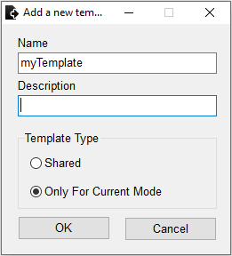

# Code Templates

You can insert a predefined piece of code called a code template by typing the template name and pressing `F2`. To display the list of available templates, press `Ctrl+J`. 

For example, if you type `for` and press `F2` the editor adds:

```text
for  =  to  // step 1

end // for
```

## Types of Templates

There are two types of templates: shared and exclusive. Shared templates are available across all [edit modes](./). They are contained in the file `data\templates.txt`. Exclusive templates are designed specifically for the current edit mode. A path to an exclusive template file can be customized with the `template` key in the `games.xml`:

```text
<templates>@sb:\data\gta3\templates.txt</templates>
```

The editor merges the content of shared and exclusive templates in a single list. Exclusive templates have priority over the shared with the same name.

## File Syntax

Each template file has the following syntax:  
A template name is written in a separate line. The equal sign `=` follows the name. After the equal sign you can also add a short hint. The template code starts at the next line, each line begins with the equals sign. The cursor position is marked with the `|` character.

## Adding a New Template

It's also possible to add a template from the editor. Select the code and click the `Service->Add template` menu. 



Enter a name of the template, a description \(optionally\) in the dialog window, choose the type of the template, and press the `OK` button. The template is ready to use.


The exclusive template option becomes unavailable if the `games.xml` does not have a template file path set for the current edit mode.



A template with the name `CLEO` unlocks the "New CLEO Script..." item in the main menu. The editor uses this template as the content for a newly created file.


