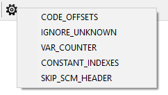

# Консоль

**Консоль** служит инструментом для переключения отладочных опций Sanny Builder. Многие из них относятся к возможностям дизассемблера и влияют на его работу.&#x20;

Окно консоли открывается нажатием `Ctrl+~`. Для запуска команды введите ее в верхнем поле и нажмите `Enter`. Консоль покажет результат.

## Доступные команды&#x20;

Все команды являются регистронезависимыми.

`help` – показать справку о консоли\
`clear` – очистить консоль\
`list` – показать список доступных команд\
`list options` – вывести все доступные отладочные опции\
`toggle <имя опции> [on/off]` – переключить [отладочную опцию](console.md#otladochnye-opcii)

Команда `toggle` заканчивается либо словом `ON` (опция будет включена), `OFF` (опция будет выключена), или ни тем ни другим (опция будет переключена с `ON` на `OFF` или с `OFF` на `ON`).


Перед включением отладочных опций включите общий режим отладки командой`toggle debug_mode ON`


## Отладочные опции

### CODE\_OFFSETS

Дизассемблер выводит для каждой команды ее адрес в файле (смещение от начала).

### VAR\_COUNTER

После компиляции в консоли содержится список [глобальных переменных](../coding/variables.md#globalnye-peremennye), которые были использованы только один раз (неиспользуемые переменные, которые можно удалить или заменить на [локальные переменные](../coding/variables.md#lokalnye-peremennye)).

### IGNORE\_UNKNOWN

Дизассемблер игнорирует ошибки в исходном коде (неизвестные опкоды, неверные типы данных, нарушения формата файла). Это помогает открыть большинство скриптов, которые были скомпилированы некорректно.

### CONSTANT\_INDEXES

Выводит элементы массива как глобальные переменные с индексом. Доступно для режимов `GTA SA`, `LCS`, `VCS`.&#x20;

Например, если в исходном файл был массив из трех элементов, начинающийся с `$10`, то при переключении этой опции переменные в дизассемблированном файле будут выглядеть следующим образом:

| `Без CONSTANT_INDEXES` | С `CONSTANT_INDEXES` |
| ---------------------- | -------------------- |
| $10                    | $10\[0]              |
| $11                    | $10\[1]              |
| $12                    | $10\[2]              |

### SKIP\_SCM\_HEADER

Дизассемблер пропускает чтение заголовка `.scm` файла. Это позволяет открывать скрипты в которых заголовка нет (например, скрипты из файла `script.img` или CLEO скрипты).

Также при включении этой опции Sanny Builder компилирует `.scm` файлы без заголовка (альтернативно использованию [директивы](../coding/directives.md#usdexternal) `{$EXTERNAL}`).

### SKIP\_EXTRA\_INFO

Дизассемблер игнорирует секцию с [дополнительной информацией](options/general.md#dobavlyat-dopolnitelnuyu-informaciyu-v-scm) в конце скрипта. Эта секция будет рассматриваться как набор SCM инструкций, поэтому рекомендуется дополнительно включить опцию `IGNORE_UNKNOWN`.

## Альтернативные способы включения

Sanny Builder предлагает несколько способов для переключения отладочных опций за пределами консоли. Эти способы могут быть полезны в определенных случаях.

### Запуск с параметром --`debug`

Запуск программы через командную строку с [параметром](cli.md#debug) `--debug` является способом одновременно переключить несколько опций. Запустите `sanny.exe` с параметром `--debug X`, где `X` это последовательность `0` и `1`.  Каждая цифра в последовательности означает определенную опцию:

| Индекс | Отладочная опция  |
| ------ | ----------------- |
| 1      | CODE\_OFFSETS     |
| 2      | IGNORE\_UNKNOWN   |
| 3      | VAR\_COUNTER      |
| 4      | CONSTANT\_INDEXES |
| 5      | SKIP\_SCM\_HEADER |
| 6      | SKIP\_EXTRA\_INFO |

```
sanny.exe --debug 110000
```

Первая `1` включит опцию `CODE_OFFSETS`, вторая `1` включит режим `IGNORE_UNKNOWN`. Оставшиеся опции будут отключены.

### Использование интерфейса программы

Клик по самой правой кнопке на панели инструментов открывает выпадающее меню со списком опций:

<div align="left">



</div>

Каждый элемент списка переключает одну из опций. Изменение будет сразу доступно для использования.
