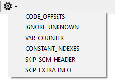

# Debug Options

**Debug options** are temporary, per-tab flags modifying the disassembler and compiler behavior. Each open tab maintains its own set of debug options. You can toggle individual options on or off from the rightmost button in the main toolbar, which opens a drop-down list showing all available debug options. Changes take effect immediately and remain active only for the current tab and session.



### List of options

#### CODE\_OFFSETS

The disassembler prints the offset of each command.

#### VAR\_COUNTER

After compiling the console contains the list of the [global variables](../language/data-types/variables.md#global-variables) used only once in the code (i.e. can be removed or replaced with [local variables](../language/data-types/variables.md#local-variables)).

#### IGNORE\_UNKNOWN

The disassembler ignores unknown opcodes, incorrect parameters and so on. It helps to open almost any file that used to be protected or compiled incorrectly.

#### CONSTANT\_INDEXES

The disassembler prints array elements as global variables with indexes. It's available for GTA SA, LCS, VCS games. It is enabled by default in GTA SA.

E.g. given an array of three elements starting at `$10` this option affects the way the variables look like after disassembling:

| Without `CONSTANT_INDEXES` | With `CONSTANT_INDEXES` |
| -------------------------- | ----------------------- |
| $10                        | $10\[0]                 |
| $11                        | $10\[1]                 |
| $12                        | $10\[2]                 |

#### SKIP\_SCM\_HEADER

Disassembler skips the header of the input file. It allows to open headless scripts (e.g. the ones from `script.img` or CLEO scripts).&#x20;

With this option the compiler makes `.scm` files without the header (similar to `{$EXTERNAL}` [directive](../language/directives.md#usdexternal)).

#### SKIP\_EXTRA\_INFO

The disassembler ignores the [extra info](options/general.md#add-extra-info-to-scm) section attached to the input file. It also treats this section as a set of regular SCM instructions, so enabling `IGNORE_UNKNOWN` option is recommended.

### Setting Debug Options Using CLI

The `--debug` [option](cli.md#debug) provides an alternate way of switching the debug options. Run Sanny with the parameter `--debug X`, where `X` is a series of `0` and `1`.  Each digit in the series corresponds to a particular debug option:

| Index | Debug Option      |
| ----- | ----------------- |
| 1     | CODE\_OFFSETS     |
| 2     | IGNORE\_UNKNOWN   |
| 3     | VAR\_COUNTER      |
| 4     | CONSTANT\_INDEXES |
| 5     | SKIP\_SCM\_HEADER |
| 6     | SKIP\_EXTRA\_INFO |

```
sanny.exe --debug 110000
```

The first `1` enables the `CODE_OFFSETS` option, the second `1` enables the `IGNORE_UNKNOWN` mode. The remaining options are disabled.
