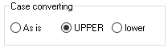

# Compiler

## Case Converting

This option serves a dual purpose. The disassembler names [global variables](../../language/data-types/variables.md#global-variables), [labels](../../language/data-types/#labels), [arrays](../../language/data-types/arrays.md) using the selected letter case. The compiler writes [string literals](../../language/data-types/#string-literals) using the selected case too.

### Show warning

This option is only used during compilation of the San Andreas scripts. If the game is running, the file `script.img` containing external scripts can not be overwritten as the game uses this file and the compiler complains about it. You may disable the warning by unchecking this box.

### Strict IF Validation

The compiler counts and validates number of used conditions in an IF statement. The limit is `8`.

### Ranges check

The number of local and global [variables](../../language/data-types/variables.md) is limited. When this option is checked, the compiler checks if a variable fits the available range.

### Add extra info to SCM

If this option is checked the compiler adds extra information at the end of the resulting file. This info is used later when this file gets disassembled to restore the source closer to the original. The following data is stored:&#x20;

* [HEX..END](../../language/instructions/hex..end.md) constructs offsets
* [global variables](../../language/data-types/variables.md#global-variables) names
* full source code (use [$NOSOURCE](../../language/directives.md#usdnosource) to disable)
* current [edit mode](../../edit-modes/)


Starting from v3.8.0 the disassembler can [ignore extra information](../console.md#skip_extra_info).

