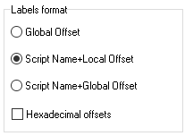

# Disassembler

<figure><figcaption></figcaption></figure>

## Disassembler Syntax

This picker allows to choose how disassembler outputs commands. You can select between opcodes, [command names](../../language/instructions/keywords.md) and [classes](../../language/instructions/classes.md).&#x20;

## Labels and Variables

<figure><figcaption></figcaption></figure>

Disassembler will transform label and variable names to selected format.

## Label Name Format

### Global Offset

A label name is numeric e.g. `@12345`. The number is the offset of the label from the beginning of the source file.

### Script+Local Offset

A label name includes a name of the script where the label is located (as defined with the `script_name` command) and the offset from the beginning of the script, e.g. `@MAIN_12`.

### Script+Global Offset

A label name includes a name of the script where the label is located (as defined with the `script_name` command) and the offset from the beginning of the source file, e.g. `@MAIN_12345`.


If you want the offsets to be hexadecimal, select the checkbox at the bottom.


## File Name Format

<figure><figcaption></figcaption></figure>

This field specifies the path and name for disassembled text files using placeholder variables:

* `$dir` – input file directory path
* `$name` – input file name (without extension)
* `$ext` – input file extension

**Example:** Input file: `C:\MyDir\main.scm`

* `$dir` = `C:\MyDir`
* `$name` = `main`
* `$ext` = `.scm`

Using format `$dir\$name.txt` creates output file: `C:\MyDir\main.txt`

## Options

### Replace mission numbers

When this option is checked, the disassembler [replaces mission numbers](../features.md#replacing-mission-numbers-with-their-names) in `start_mission` with their names. The mission name is the label name defined in the file header. This name also could be used to quickly navigate to the mission code.

### Insert original mission names

When this option is checked, the disassembler adds the [mission title](../features.md#custom-mission-titles) as a comment for the opcode `start_mission` and for the line `DEFINE MISSION` in the file header.

### Disassemble with IF AND / IF OR&#x20;

Disassembler replaces the [number of conditions](../../language/control-flow/conditions.md#syntax) in the `IF` opcode with `AND` or `OR`

### Always overwrite output file

This option determines how the disassembler treats the output file when a file with the same name exists already. By default the disassembler keeps the existing file and creates a new one with the extra number in the name (e.g. `main[0].txt`).&#x20;

When this option is checked the disassembler replaces the existing file with a new file.

### Manual IMG opening

When the disassembling process starts, the program searches the file `script.img` containing some game scripts. If this file is not present in the same folder with the `.SCM` file or in the `San Andreas\data\scripts` folder, the error message is displayed. If this option is enabled, a file select dialog appears and you can provide another `script.img` file manually.
