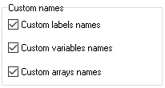

# Edit modes

Here you can decide what modes to display in the edit mode list at the bottom right corner and change some shared options.

<figure><figcaption></figcaption></figure>

The file [`CustomLabels.ini`](../../edit-modes/customlabels.ini.md) contains the list of label names and their offsets. If the disassembler finds a match between the label offset in the source file and the offset defined in the INI file it gives this label a name associated with this offset.

The file `CustomVariables.ini` contains the list of [global variables](../../language/data-types/variables.md#global-variables) addresses and their custom names. The disassembler uses this file to name global variables.

The file `CustomArrays.ini` contains names of the arrays in the following syntax: the first number is the global variable address which is the first element of the array, then the array size, then a custom name. It helps the disassembler to recognize [array elements](../../language/data-types/arrays.md#using-constant-indexes).
