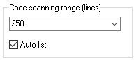
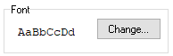

# Editor

Here you can change the IDE settings.

## Color Theme

.PNG>)

This picker allows to choose one of the pre-defined themes to customize interface colors and syntax highlighting. The Edit button launches [Theme Editor](theme-editor.md).

## Code Scan Distance

The code scanning range is used when you press `Ctrl+Space` to find [constants](../../coding/constants.md), labels and [variables](../../coding/variables.md). The value tells the editor how many lines to scan up and down starting from the active line. If you set a number of `0`, the editor scans the whole source file.

If the `Auto list` option is checked, the list of available labels, models and variables appears automatically as you type `@`, `$`, `#`.

## Font

Here you can choose the font and configure its display. Sanny Builder supports only [monospaced fonts](https://en.wikipedia.org/wiki/Monospaced_font). `AaBbCcDd` reflects selected configuration.

## Editor Configuration

`Show main panel` – toggle the top toolbar\
`Show opcode info` – make the editor display [different information](../features.md#displaying-information-about-opcode) in the bottom bar\
`Line numbers` – display line numbers in the left padding area\
`Show gutter border` – display the border line on the right side of the left padding area. Uncheck this option to increase the available space visually\
`Load last closed file at startup` – open the last closed file at startup\
`Load all closed files` – open all closed files at startup. This option is only available when the Load last closed file at startup is checked\
`Confirm when exit` – confirm exit to prevent occasional program termination\
`Enable language service` - toggle the [language service](../language-service.md). Disabling this service also makes the semantinc contants highlighting unavailable. Does not affect a document that is already opened in the editor\
`Semantic highlighting` - apply the same rules to constants as to their values. The color theme's rules for constant highlighting will be ignored.

##
