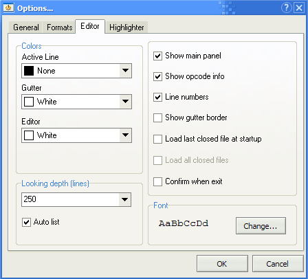
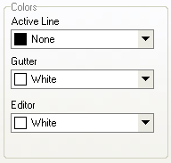
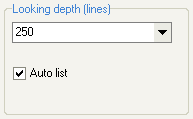
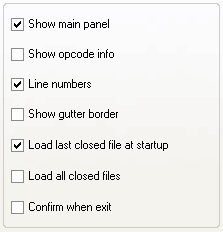
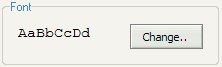

# Editor

Here you can change the IDE settings.

## Editor Colors

The following options allow to set up different colors for the editor.

`Active line` - the background color of the line with the cursor  
`Gutter` - the background color of the area on the left side of the code area \(with line numbers\)  
`Editor` - the background color of the code area

## Code Scan Distance

The code scan distance \(looking depth\) is used when you press `Ctrl+Space` to find [constants](../../coding/constants.md), labels and [variables](../../coding/variables.md). The value tells the editor how many lines to scan up and down starting from the active line. If you set a number of `0`, the editor scans the whole source file.

If the `Auto list` option is checked, the list of available labels, models and variables appears automatically as you type `@`, `$`, `#`.

`Show main panel` – toggle the main toolbar  
`Show opcode info` – make the editor display important information in the status bar \(number of expecting parameters for an opcode, model ID, variable type, etc\)  
`Line numbers` – show line numbers in the left padding area  
`Show gutter border` – display the border line on the right side of the left padding area. Uncheck this option to increase the available space visually.  
`Load last closed file at startup` – open the last closed file at startup  
`Load all closed files` – open all closed files at startup. This option is only available when the Load last closed file at startup is checked.  
`Confirm when exit` – confirm exit to prevent occasional program termination.

## Font

Here you can choose the font and configure its display. Sanny Builder supports only [monospaced fonts](https://en.wikipedia.org/wiki/Monospaced_font). `AaBbCcDd` reflects selected configuration.

