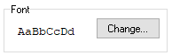
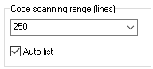
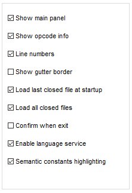

# Editor

Here you can change the IDE settings.

<figure><figcaption></figcaption></figure>

## Font

Here you can choose the font and configure its display. Sanny Builder supports only [monospaced fonts](https://en.wikipedia.org/wiki/Monospaced_font). `AaBbCcDd` reflects selected configuration.

## Code Scan Distance

The code scanning range is used when you press `Ctrl+Space` to find [constants](../../language/data-types/constants.md), labels and [variables](../../language/data-types/variables.md). The value tells the editor how many lines to scan up and down starting from the active line. If you set a number of `0`, the editor scans the whole source file.

If the `Auto list` option is checked, the list of available labels, models and variables appears automatically as you type `@`, `$`, `#`.

## Editor Configuration

### Show Main Panel

Toggles the top toolbar

### Show Opcode Info

Displays [different information](../features.md#displaying-information-about-opcode) in the bottom bar

### Line Numbers

Displays the line numbers in the left padding area

### Show Gutter Border

Toggles the border line on the right side of the left padding area. Uncheck this option to visually increase the available space

### Load Last Closed File at Startup

Enables reopening the last closed file at startup

### Load All Closed Files

Enables reopening all closed files at startup. This option is only available when the Load last closed file at startup is checked

### Confirm When Exit

Enables a confirmation dialog to prevent occasional exit

### Enable Language Service

Toggles the [language service](../language-service.md). Disabling this service also makes the semantic constants highlighting unavailable. Does not affect a document that is already opened in the editor

### Semantic Highlighting

Enables hIghlighting of constants as to their values. The color theme's rules for constant highlighting will be ignored.
