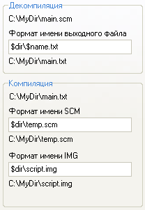
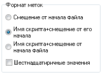
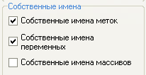
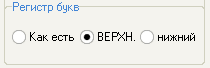

# Форматирование

На данной вкладке вы можете настроить имена для выходных файлов, форматы меток, регистры строковых литералов и т.д.

## Имена файлов

Настройка для имен файлов, получаемых после дизассемблирования и компиляции. 

В верхнем поле указывается формат для текстового файла, в который записывается содержимое дизассемблированого скрипта. В нижних двух – форматы для бинарных файлов `SCM` и `IMG` \(в [режиме](../../edit-modes/) `GTA SA`\), содержащих скомпилированные скрипты. 

Все поля имеют общий синтаксис. Можно использовать специальные слова, которые представляют часть имени исходного файла:

`$dir` – путь к исходному файлу   
`$name` – имя исходного файла  
`$ext` – расширение исходного файла

Например, если вы дизассемблируете файл `C:\MyDir\main.scm`, то

`$dir` это `C:\MyDir`   
`$name` это `main`   
`$ext` это `.scm` 

Если в верхнем поле указано `$dir\$name.txt`, то текстовый файл будет сохранен как `C:\MyDir\main.txt`

## Имена меток

Формат меток, который используется при дизассемблировании скриптов.

### Смещение от начала файла

Имена меток представляют собой адрес этих меток в исходном файле, например `@12345`.

### Имя скрипта+Смещение от его начала

Имена меток состоят из имени скрипта, в котором они находятся \(определяется командой `name_thread`\) и смещения от начала скрипта. Например, `@MAIN_12`.

### Имя скрипта+Смещение от начала файла

Имена меток состоят из имени скрипта, в котором они находятся \(определяется командой `script_name`\) и смещения от начала исходного файла. Например, `@MAIN_12345`.


Для вывода смещений в 16-ричном формате, поставьте нижнюю галочку. 


## Собственные имена

Опции, которые указывают дизассемблеру использовать имена, определенные пользователем во внешних файлах.

Имена меток содержатся в файле [`CustomLabels.ini`](../../edit-modes/customlabels.ini.md). Файл представляет собой список имен меток и их смещений от начала файла. Если данная опция выбрана, дизассемблер при соответствии позиции метки в исходном файле одной из позиций в данном списке, назовет метку так, как указано в списке. 

Имена глобальных [переменных](../../coding/variables.md#globalnye-peremennye) содержатся в файле `CustomVariables.ini`.Файл представляет собой список оригинальных числовых имен глобальных переменных \(`DMA`\) и их текстовые эквиваленты. При включении данной опции дизассемблер будет называть переменные указанными именами.

Имена массивов содержатся в файле `CustomArrays.ini`. Формат файла следующий: первым числом на строке стоит оригинальное имя переменной – начало массива, затем через пробел количество элементов в массиве – размер, затем текстовое имя. Данная опция предназначена для того, чтобы дизассемблер распознавал [элементы массива](../../coding/arrays.md#ispolzovanie-celochislennykh-konstant).


Содержимое файлов `CustomLabels.ini`, `CustomVariables.ini`, `CustomArrays.ini` в комплекте Sanny Builder составлено для оригинального`main.scm` версии 1.0


## Регистр букв

Эта опция имеет 2 значения. Дизассемблер, используя данную опцию, будет именовать [глобальные переменные](../../coding/variables.md#globalnye-peremennye), [метки](../../coding/data-types.md#metki), [массивы ](../../coding/arrays.md)в указанном регистре букв. Компилятор будет записывать [строковые литералы](../../coding/data-types.md#strokovye-literaly) также в указанном регистре.

