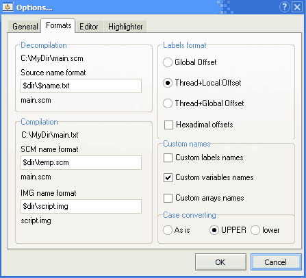
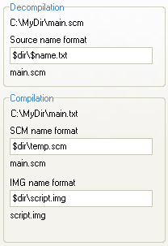
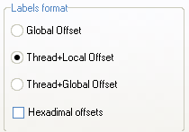
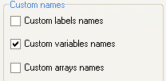
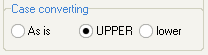

# Форматирование

Here you can set up source file names, labels format, and identifiers case.

## Имена файлов

There the file name masks are present. The upper line contains path and name of the text file which is created at decompiling. Bottom lines contain paths and names of two binary files `SCM` and `IMG` which are created at compiling. All lines have the same syntax. It uses the special words meaning a part of the full file name:

`$dir` – file path   
`$name` – file name   
`$ext` – file extension

E.g. if you decompile the file `C:\MyDir\main.scm`, then

`$dir` is `C:\MyDir`   
`$name` is `main`   
`$ext` is `.scm` So, if the mask is `$dir$name.txt`, the output file will be named `C:\MyDir\main.txt`

## Имена меток

Here you may choose one of the various name formats for the labels used at decompiling.

### Смещение от начала файла

all labels will have a numeric name, for example `@12345`. The number means this label’s offset in the file being decompiled.

### Имя скрипта+Смещение от его начала

label name will consist of two parts: a name of the thread where the label is \(the `name_thread` opcode is used for this\), and additionally offset from this thread’s beginning, for example `@MAIN_12`.

### Имя потока+Смещение от начала файла

this option is similar to the previous one, except that after the thread name there will be not a local offset but the global one \(as the first case\), for example `@HELP_34567`.

If you want the offsets to be hexadecimal, select the proper option. By default, all offsets are decimal.

## Собственные имена

These options make the decompiler use or not the custom names for the various code elements.

The labels names are contained in the file `CustomLabels.ini` in the folder `SB\data`. This file contains the list of labels names and offsets. If the first box checked, the decompiler names the label as defined.

The variables names are present in the file `CustomVariables.ini` for each game. It contains the list of [global variables](../../coding/variables.md#global-variables) addresses and their custom names. If this box checked, the decompiler uses this file to name the global variables.

The arrays names list are present in the file `CustomArrays.ini`. Its syntax is as follows: the first number is the global variable name which is the first element of the array \(`array name`\), the second – `array size`, the third – `custom name`. It helps the decompiler to recognize a global variable as an array element and add the index to it.

## Регистр букв

This option has two meanings. The decompiler names the global variables, labels, arrays using the selected letter case. The compiler writes the strings in the `SCM` using the selected letter case as well.

