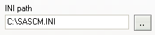
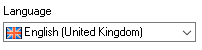
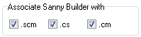
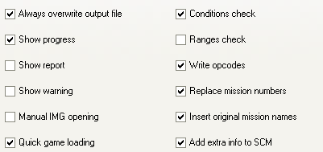

# General

This tab contains the general settings used by Sanny Builder.

## Game Directory

Sanny Builder needs certain game files while working, so you have to choose a correct directory where the game for the current edit mode is installed. You may input the path manually or by selecting the directory via the dialog appearing when you press the button.

## Opcodes Path

The program also needs the file containing the opcodes list. You may set the path to this file here \(manually or by selecting file dialog appearing when you press the button\).

## Interface Language

List of available translations for Sanny Builder. Select a language to update the program interface. 

Translation files are located in the `lang` folder. More information on how to create a new translation or update the existing one can be found at [sannybuilder/translations](https://github.com/sannybuilder/translations).

## File Association

You may associate different file extensions with Sanny Builder. When a checkbox is selected, your Windows Registry is changed and you may open the files with this extension simply by clicking it. To cancel the association, unselect a proper checkbox.

## Core Settings

Here you see the options of the disassembler and the compiler.

### Always overwrite output file

This option determines how the disassembler treats the output file when a file with the same name exists already. By default the disassembler keeps the existing file and creates a new one with the extra number in the name \(e.g. `main[0].txt`\). 

When this option is checked the disassembler replaces the existing file with a new file.

### Show progress

Display a live progress bar during disassembling or compilation. Showing the progress slightly slows the execution time. When this option is turned off the status bar displays the words: `Please wait`. 

### Show warning

This option is only used during compilation of the San Andreas scripts. If the game is running, the file `script.img` containing external scripts can not be overwritten as the game uses this file and the compiler complains about it. You may disable the warning by unchecking this box.

### Manual IMG opening

When the disassembling process starts, the program searches the file `script.img` containing some game scripts. If this file is not present in the same folder with the `.SCM` file or in the `San Andreas\data\scripts` folder, the error message is displayed. If this option is enabled, a file select dialog appears and you can provide another `script.img` file manually.

### Quick game loading

With this option Sanny Builder skips the startup splash screens when launching San Andreas \(`F8`\). If this feature does not work with your game version, disable this option.

### Check conditions

This option has two meanings. First, the program replaces the [number of conditions](../../coding/conditions.md#syntax) in the `IF` opcode with `AND` or `OR`. Second, the program is able to compile the `IF..END` construct, and calculate needed `IF` parameter in the conditions with words `AND` or `OR`.

### Ranges check

The number of local and global [variables](../../coding/variables.md) is limited. When this option is checked, the compiler checks if a variable fits the available range.

### Write opcodes

If this option is unchecked, the disassembler uses available [classes](../../coding/classes.md) and [keywords](../../coding/keywords.md) instead of opcodes. In addition, simple math expressions have no opcodes. 

If the option is checked, all opcodes are present in the output file.

### Replace mission numbers

When this option is checked, the disassembler [replaces mission numbers](../../features.md#replacing-mission-numbers-with-their-names) in `start_mission` with their names. The mission name is the label name defined in the file header. This name also could be used to quickly navigate to the mission code.

### Insert original mission names

When this option is checked, the disassembler adds the [mission title](../../features.md#custom-mission-titles) as a comment for the opcode `start_mission` and for the line `DEFINE MISSION` in the file header.

### Add extra info to SCM

If this option is checked the compiler adds extra information at the end of the resulting file. This info is used later when this file gets disassembled to restore the source closer to the original. The following data is stored: 

* [HEX..END](../../coding/hex..end.md) constructs offsets
* [global variables](../../coding/variables.md#global-variables) names
* full source code \(use [$NOSOURCE](../../coding/directives.md#usdnosource) to disable\)
* current [edit mode](../../edit-modes.md)


The file compiled with extra information can not be open with Sanny Builder prior to v3.00 \(except the case when `ignore_unknown` [option](../../console.md#ignore_unknown) is enabled\).


