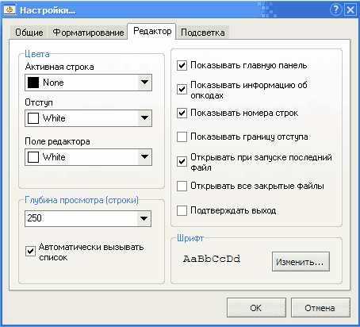
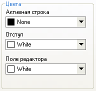
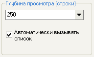
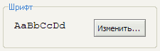
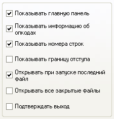

# Редактор

На данной вкладке вы можете изменить настройки IDE.

## Цвета

Следующие опции позволяют установить цвета различных элементов окна редактора.

`Активная строка` - цвет строки, на которой стоит курсор  
`Отступ` - цвет левого края редактора  
`Поле редактора` - фон текста в редакторе

## Глубина просмотра кода

Значение глубины просмотра используется при построении списка [констант](../coding/constants.md), [меток](../coding/data-types.md#metki) и [переменных](../coding/variables.md) после нажатия комбинации `Ctrl+пробел`. Это значение говорит редактору, как много строк кода нужно просмотреть в обе стороны от текущей строки. Если указано значение `0`, программа будет искать указанные элементы по всему файлу.

Если галочка внизу поставлена, список меток, моделей и переменных будет появляться автоматически после набора  `@`, `$`, `#`.

## Шрифт

Здесь вы можете выбрать шрифт и его настройки для редактора. Sanny Builder поддерживает только [моноширинные шрифты](https://ru.wikipedia.org/wiki/%D0%9C%D0%BE%D0%BD%D0%BE%D1%88%D0%B8%D1%80%D0%B8%D0%BD%D0%BD%D1%8B%D0%B9_%D1%88%D1%80%D0%B8%D1%84%D1%82). Строка `AaBbCcDd` отражает текущие настройки.

## Настройки

`Показывать главную панель` – показать/спрятать панель с кнопками в главном окне редактора  
`Показывать информацию об опкодах` – отображать в статусной строке внизу экрана различную информацию: кол-во параметров опкода, номер модели, тип переменной и т.д.  
`Показывать номера строк` – отображать номера строк в отступе в левой части редактора   
`Показывать границу отступа` – показать границу для отступа в левой части редактора. Отключите данную опцию, чтобы визуально увеличить пространство редактора  
`Открывать при запуске последний файл` – открывать при запуске программы последний закрытый файл, если таковой существует  
`Открывать все закрытые файлы` – открывать разом все закрытые файлы при запуске. Данная опция может быть выбрана только вместе с `Открывать при запуске последний файл`  
`Подтверждать выход` – включить подтверждение для закрытия программы. Полезно для предотвращения случайного выхода

