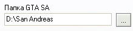
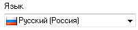
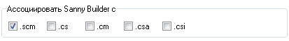
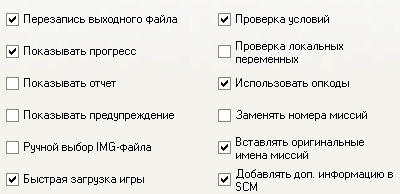

# Общие настройки

Данная вкладка содержит общие настройки программы.

## Директория игры

Путь к папке, где установлена игра для текущего [режима редактирования](../edit-modes/). Путь можно ввести вручную или выбрать через диалог, появляющийся при нажатии кнопки.

## Язык интерфейса

Список доступных языков для интерфейса программы. Сами переводы находится в папке `lang`. Информацию о создании новых переводов можно найти на [sannybuilder/translations](https://github.com/sannybuilder/translations).

## Привязка файловых расширений

Файлы с отмеченными расширениями по умолчанию открываются в Sanny Builder. Для отмены ассоциации, снимите галочку.

## Настройки

### Перезапись выходного файла

Перезаписывать файл с результатом дизассемблирования, если файл с таким именем уже существует. Если опция не выбрана,  дизассемблер создаст новый файл, добавив к нему индекс \(например, `main[0].txt`\).

### Показывать прогресс

Отображать текущий прогресс при работе дизассемблера или компилятора. Без этой опции в статусбаре будут слова `Пожалуйста ждите…`. 

Показ прогресса немного замедляет процесс \(де\)компиляции.

### Показывать отчет

Отображать диалоговое окно с различной информацией о скомпилированном файле.

### Показывать предупреждение

Данная опция имеет значение только при компиляции скриптов San Andreas. Если игра запущена ко время компиляции, то файл `script.img`, содержащий часть скриптов, не может быть изменен, поскольку игра использует его. Компилятор покажет об этом предупреждение. Вы можете отключить показ предупреждения, выбрав данную опцию.

### Ручной выбор IMG-файла

При дизассемблировании `main.scm` в режиме `GTA SA` программа ищет файл `script.img`, содержащий часть игровых скриптов. Если файл не найден в одной папке с `main.scm` или в папке игры, то будет показана ошибка. Однако при выборе данной опции вы сможете выбрать `script.img` вручную.

### Быстрая загрузка игры

Sanny Builder способен пропускать начальные заставки при запуске San Andreas \(`F8`\). Если данная возможность вызывает ошибку в вашей версии игры, отключите данную опцию.

### Проверка условий

Данная опция имеет 2 значения. При дизассемблировании скриптов программа заменяет [количество условий](../coding/conditions.md#obshii-sintaksis-uslovnykh-vyrazhenii) в `IF` на слова `AND` и `OR`. При компиляции появляется поддержка конструкции `IF..END`, а также возможность компилировать `IF` со словами `AND` и `OR`.

### Проверка переменных

Количество используемых глобальных и локальных [переменных](../coding/variables.md) имеет свои [лимиты](../scm-documentation/gta-limits.md). При включении данной опции компилятор будет проверять правильность их использования.

### Использовать опкоды

При выключении этой опции дизассемблер использует [классы](../coding/classes.md) и [ключевые слова](../coding/keywords.md), заменяя ими опкоды. Также не будут записываться опкоды для некоторых простых математических выражений. 

При включении данной опции все опкоды будут записываться в исходник.

### Заменять номера миссий

При включении данной опции дизассемблер [заменяет](../features.md#zamena-nomerov-missii-na-ikh-nazvaniya) номера миссий в `start_mission` на их имена. Например, `start_mission INITIAL`. Имя миссии определяется по имени метки в заголовке файла. Еe также можно использовать для [быстрого перехода](../features.md#bystryi-perekhod-po-tekstu) к началу миссии.

### Вставлять оригинальные имена миссий

Когда данная опция включена, декомпилятор добавляет заранее определенные [имена миссий](../features.md#ispolzovanie-originalnykh-imen-missii) как комментарии к `start_mission`, а также к строке `DEFINE MISSION` в заголовке файла.

### Добавлять дополнительную информацию в SCM

При включении данной опции компилятор сохраняет информацию о скрипте в теле скомпилированного файла. Эта информация используется в дальнейшем при дизассемблировании для достижения максимального соответствия оригиналу:

* адреса конструкций [HEX..END](../coding/hex..end.md)
* имена [глобальных переменных](../coding/variables.md#globalnye-peremennye)
* оригинальный исходный код \(см. также [$NOSOURCE](../coding/directives.md#usdnosource)\)
* [режим редактирования](../edit-modes/)


Скрипт, скомпилированный с дополнительной информацией, нельзя открыть в версиях Sanny Builder ранее v3.0 \(кроме случая включения [опции](../console.md#ignore_unknown) `ignore_unknown`\).

Начиная с версии 3.8.0, дизассемблер может [игнорировать дополнительную информацию](../console.md#skip_extra_info).


