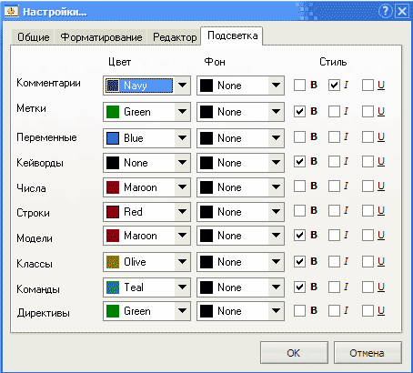

# Подсветка синтаксиса

На данной вкладке вы можете настроить подсветку синтаксиса в окне редактора.

Каждый элемент кода имеет 3 свойства: `Цвет`, `Фон`, `Стиль`.

Доступны 3 элемента `стиля`: **B** – полужирный, **I** – курсив, **U** – подчеркнутый.

Выбранный вариант подсветки используется также при сохранении кода в формат `RTF` или `HTML`.

### Элементы кода

* [Комментарии](../features.md#kommentirovanie-koda) – текст после `//`, а также между `{}` или `/* */`
* [Метки](../coding/data-types.md#metki) – идентификаторы, начинающиеся с `@`
* [Переменные](../coding/variables.md) – идентификаторы, начинающиеся с `$` \(глобальные переменные\), или заканчивающиеся на `@` \(локальные переменные\) Тип [aDMA](../coding/data-types.md#peremennye) \(начинается с `&`\) и [массивы](../coding/arrays.md) подсвечиваются как переменные.
* [Ключевые слова](../coding/keywords.md) – специальные слова, записанные в файле `keywords.ini` \(один для всех [режимов редактирования](../edit-modes/)\) и `keywords.txt` \(свой для каждого режима\)
* Числа – целые и дробные числа
* Строковые литералы – текст между двойными `" "` или одинарными `' '` кавычками
* Модели – идентификаторы, начинающиеся с `#`
* [Классы](../coding/classes.md) – имена классов \(идентификатор перед `.`\)
* Команды – члены класса \(идентификатор после `.`\)
* [Директивы ](../coding/directives.md)– текст после комбинации символов `{$`

