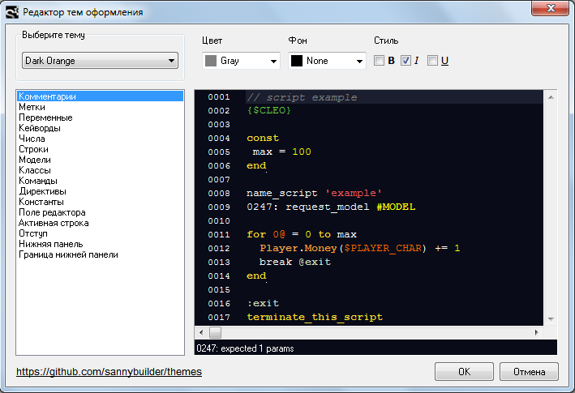

# Редактор тем оформления

**Редактор тем** - это встроенная утилита, которая заменяет вкладку настроек подсветки синтаксиса. Он может быть запущен из вкладки [Редактор](editor.md#tema-oformleniya).

Для кастомизации доступны цвета и стили некоторых элементов интерфейса и кода.

У таких элементов можно изменить 3 свойства: `Цвет`, `Фон`, `Стиль`. Некоторые свойства могут быть недоступны для определенных элементов.

Для комбинирования между собой доступны 3 варианта `стиля`: **B** – полужирный, **I** – курсив, **U** – подчеркнутый.

### Элементы интерфейса 

* **Поле редактора** – цвет текста и фон основной области редактирования
* **Активная строка** – фон строки, на которой находится курсор
* **Отступ** – цвет текста и фон области слева от редактора
* **Нижняя панель** – цвет текста и фон панели под редактором
* **Граница нижней панели** – цвет границ отдельных секций в нижней панели

### Элементы кода 

* [Комментарии](../features.md#kommentirovanie-koda) – текст после `//`, а также между `{}` или `/* */`
* [Метки](../coding/data-types.md#metki) – идентификаторы, начинающиеся с `@`
* [Переменные](../coding/variables.md) – идентификаторы, начинающиеся с `$` \(глобальные переменные\), или заканчивающиеся на `@` \(локальные переменные\) Тип [aDMA](../coding/data-types.md#peremennye) \(начинается с `&`\) и [массивы](../coding/arrays.md) подсвечиваются как переменные.
* [Ключевые слова](../coding/keywords.md) – специальные слова, записанные в файле `keywords.ini` \(один для всех [режимов редактирования](../edit-modes/)\) и `keywords.txt` \(свой для каждого режима\)
* Числа – целые и дробные числа
* Строковые литералы – текст между двойными `" "` или одинарными `' '` кавычками
* Модели – идентификаторы, начинающиеся с `#`
* [Классы](../coding/classes.md) – имена классов \(идентификатор перед `.`\)
* Команды – члены класса \(идентификатор после `.`\), а также [функции](../coding/data-types.md#metki)
* [Директивы ](../coding/directives.md)– текст после комбинации символов `{$`
* [Константы](../coding/constants.md) - идентификаторы, объявленные внутри конструкции `CONST..END`. См. также [Семантическая подсветка](editor.md#nastroiki).


Правила подсветки используются также при сохранении кода в формат `RTF` или `HTML`.


