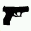

# Tattoos

```text
Player.SetClothes($PLAYER_CHAR, <texture>, <model>, <body part>)
```

| Texture | Model | [Body Part](player-body-parts.md) | Tattoo Name | Image |
| :--- | :--- | :--- | :--- | :--- |
| 4weed | 4WEED | 4 | Weed |  |
| 4rip | 4RIP | 4 | Grave |  |
| 4spider | 4SPIDER | 4 | Spider |  |
| 5gun | 5GUN | 5 | Gun |  |
| 5cross | 5CROSS | 5 | Cross |  |
| 5cross2 | 5CROSS2 | 5 | Rose |  |
| 5cross3 | 5CROSS3 | 5 | Clown |  |
| 6aztec | 6AZTEC | 6 | Aztec |  |
| 6crown | 6CROWN | 6 | Web |  |
| 6clown | 6CLOWN | 6 | Clown |  |
| 6africa | 6AFRICA | 6 | Africa |  |
| 7cross | 7CROSS | 7 | Cross |  |
| 7cross2 | 7CROSS2 | 7 | Cross |  |
| 7cross3 | 7CROSS3 | 7 | Cross |  |
| 7mary | 7MARY | 7 | Mary |  |
| 8sa | 8SA | 8 | Grove St . |  |
| 8sa2 | 8SA2 | 8 | San Andreas |  |
| 8sa3 | 8SA3 | 8 | San Fierro |  |
| 8westside | 8WESTSD | 8 | Westside |  |
| 8santos | 8SANTOS | 8 | Los Santos |  |
| 8poker | 8POKER | 8 | Card |  |
| 8gun | 8GUN | 8 | Gun |  |
| 9crown | 9CROWN | 9 | Crown |  |
| 9gun | 9GUN | 9 | Gun |  |
| 9gun2 | 9GUN2 | 9 | Gun |  |
| 9homeboy | 9HOMBY | 9 | Homeboy |  |
| 9bullet | 9BULLT | 9 | Bullet |  |
| 9rasta | 9RASTA | 9 | Rasta |  |
| 10ls | 10LS | 10 | Los Santos |  |
| 10ls2 | 10LS2 | 10 | Los Santos |  |
| 10ls3 | 10LS3 | 10 | Los Santos |  |
| 10ls4 | 10LS4 | 10 | Los Santos |  |
| 10ls5 | 10LS5 | 10 | Los Santos |  |
| 10og | 10OG | 10 | O.G. |  |
| 10weed | 10WEED | 10 | Grove |  |
| 11grove | 11GROVE | 11 | Grove |  |
| 11grove2 | 11GROV2 | 11 | Grove |  |
| 11grove3 | 11GROV3 | 11 | Grove |  |
| 11dice | 11DICE | 11 | Dice |  |
| 11dice2 | 11DICE2 | 11 | Dice |  |
| 11jail | 11JAIL | 11 | Jail |  |
| 11godsgift | 11GGIFT | 11 | God's Gift |  |
| 12angels | 12ANGEL | 12 | Angel |  |
| 12mayabird | 12MAYBR | 12 | Mayan Bird |  |
| 12dagger | 12DAGER | 12 | Dagger |  |
| 12bandit | 12BNDIT | 12 | Masks |  |
| 12cross7 | 12CROSS | 12 | Cross |  |
| 12mayaface | 12MYFAC | 12 | Mayan Face |  |

See also: [Player Clothes](clothes.md)

