# Tattoos

```
Player.SetClothes($PLAYER_CHAR, <texture>, <model>, <body part>)
```

## Lower left arm


| Texture | Model   | [Body Part](player-body-parts.md) | Tattoo Name | Image                                                                     |
| ------- | ------- | --------------------------------- | ----------- | ------------------------------------------------------------------------- |
| 4weed   | 4WEED   | 4                                 | Weed        |    |
| 4rip    | 4RIP    | 4                                 | Grave       | 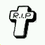    |
| 4spider | 4SPIDER | 4                                 | Spider      |  |

## Upper left arm

| Texture | Model   | [Body Part](player-body-parts.md) | Tattoo Name | Image                                                                     |
| ------- | ------- | --------------------------------- | ----------- | ------------------------------------------------------------------------- |
| 5gun    | 5GUN    | 5                                 | Gun         | 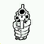    |
| 5cross  | 5CROSS  | 5                                 | Cross       | 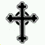  |
| 5cross2 | 5CROSS2 | 5                                 | Rose        |  |
| 5cross3 | 5CROSS3 | 5                                 | Clown       |  |

## Upper right arm

| Texture | Model   | [Body Part](player-body-parts.md) | Tattoo Name | Image                                                                     |
| ------- | ------- | --------------------------------- | ----------- | ------------------------------------------------------------------------- |
| 6aztec  | 6AZTEC  | 6                                 | Aztec       | 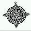  |
| 6crown  | 6CROWN  | 6                                 | Web         | 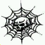  |
| 6clown  | 6CLOWN  | 6                                 | Clown       |   |
| 6africa | 6AFRICA | 6                                 | Africa      |  |

## Lower right arm

| Texture | Model   | [Body Part](player-body-parts.md) | Tattoo Name | Image                                                                     |
| ------- | ------- | --------------------------------- | ----------- | ------------------------------------------------------------------------- |
| 7cross  | 7CROSS  | 7                                 | Cross       | 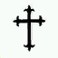  |
| 7cross2 | 7CROSS2 | 7                                 | Cross       | 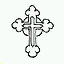 |
| 7cross3 | 7CROSS3 | 7                                 | Cross       | 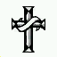 |
| 7mary   | 7MARY   | 7                                 | Mary        | 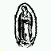   |

## Back top

| Texture   | Model   | [Body Part](player-body-parts.md) | Tattoo Name | Image                                                                     |
| --------- | ------- | --------------------------------- | ----------- | ------------------------------------------------------------------------- |
| 8sa       | 8SA     | 8                                 | Grove St .  |      |
| 8sa2      | 8SA2    | 8                                 | San Andreas |     |
| 8sa3      | 8SA3    | 8                                 | San Fierro  |     |
| 8westside | 8WESTSD | 8                                 | Westside    | 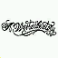 |
| 8santos   | 8SANTOS | 8                                 | Los Santos  | 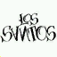 |
| 8poker    | 8POKER  | 8                                 | Card        | 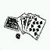  |
| 8gun      | 8GUN    | 8                                 | Gun         | 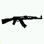    |

## Left chest

| Texture  | Model  | [Body Part](player-body-parts.md) | Tattoo Name | Image                                                                       |
| -------- | ------ | --------------------------------- | ----------- | --------------------------------------------------------------------------- |
| 9crown   | 9CROWN | 9                                 | Crown       |     |
| 9gun     | 9GUN   | 9                                 | Gun         | 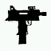      |
| 9gun2    | 9GUN2  | 9                                 | Gun         |  |
| 9homeboy | 9HOMBY | 9                                 | Homeboy     | 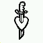    |
| 9bullet  | 9BULLT | 9                                 | Bullet      | 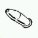    |
| 9rasta   | 9RASTA | 9                                 | Rasta       | 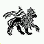    |

## Right chest

| Texture | Model  | [Body Part](player-body-parts.md) | Tattoo Name | Image                                                                    |
| ------- | ------ | --------------------------------- | ----------- | ------------------------------------------------------------------------ |
| 10ls    | 10LS   | 10                                | Los Santos  | 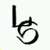   |
| 10ls2   | 10LS2  | 10                                | Los Santos  |   |
| 10ls3   | 10LS3  | 10                                | Los Santos  |   |
| 10ls4   | 10LS4  | 10                                | Los Santos  | 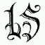  |
| 10ls5   | 10LS5  | 10                                | Los Santos  |   |
| 10og    | 10OG   | 10                                | O.G.        | 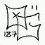   |
| 10weed  | 10WEED | 10                                | Grove       | 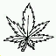 |

## Stomach

| Texture    | Model   | [Body Part](player-body-parts.md) | Tattoo Name | Image                                                                     |
| ---------- | ------- | --------------------------------- | ----------- | ------------------------------------------------------------------------- |
| 11grove    | 11GROVE | 11                                | Grove       |  |
| 11grove2   | 11GROV2 | 11                                | Grove       | 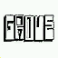 |
| 11grove3   | 11GROV3 | 11                                | Grove       |  |
| 11dice     | 11DICE  | 11                                | Dice        | 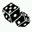  |
| 11dice2    | 11DICE2 | 11                                | Dice        | 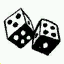 |
| 11jail     | 11JAIL  | 11                                | Jail        | 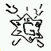  |
| 11godsgift | 11GGIFT | 11                                | God's Gift  | 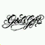 |

## Lower back

| Texture    | Model   | [Body Part](player-body-parts.md) | Tattoo Name | Image                                                                     |
| ---------- | ------- | --------------------------------- | ----------- | ------------------------------------------------------------------------- |
| 12angels   | 12ANGEL | 12                                | Angel       | 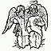 |
| 12mayabird | 12MAYBR | 12                                | Mayan Bird  | 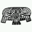 |
| 12dagger   | 12DAGER | 12                                | Dagger      | 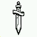 |
| 12bandit   | 12BNDIT | 12                                | Masks       |  |
| 12cross7   | 12CROSS | 12                                | Cross       | 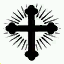 |
| 12mayaface | 12MYFAC | 12                                | Mayan Face  | 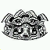 |
