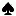
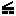
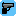
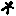
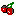
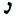
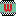

# Radar Icons

| ID | Icon                                                                           | Description             |
| -- | ------------------------------------------------------------------------------ | ----------------------- |
| 0  |               | Small pink square       |
| 1  |  | Player position         |
| 2  |             | Pink arrow              |
| 3  |       | North                   |
| 4  |       | Avery Carrington        |
| 5  |       | Big Mitch Baker         |
| 6  |      | Colonel Cortez          |
| 7  |        | Ricardo Diaz            |
| 8  |        | Kent Paul               |
| 9  |      | Lawyer (Ken Rosenberg)  |
| 10 |        | Phil Cassidy            |
| 11 |            | Biker's Bar             |
| 12 |          | Boatyard                |
| 13 |              | Malibu Club             |
| 14 |            | Cubans                  |
| 15 |        | Film Studio             |
| 16 |               | Ammu-nation             |
| 17 |          | Haitians                |
| 18 |          | Toolshop                |
| 19 |        | Safe House              |
| 20 |       | Pole Position Club      |
| 21 |          | Cherry Poppers Factory  |
| 22 |             | Kaufman Cabs            |
| 23 |          | Love Fist               |
| 24 |        | Print Works             |
| 25 |                                                                                | (no icon)               |
| 26 |           | Sunshine Autos          |
| 27 |             | Pay 'n' Spray           |
| 28 |            | Clothes                 |
| 29 |             | Vercetti's Mansion      |
| 30 |             | Phone                   |
| 31 |        | Wildstyle Radio station |
| 32 |            | Flash Radio station     |
| 33 |            | KChat Radio station     |
| 34 |            | Fever Radio station     |
| 35 |            | VRock Radio station     |
| 36 |             | VCPR Radio station      |
| 37 |        | Espantoso Radio station |
| 38 |      | Emotion Radio station   |
| 39 |             | Wave Radio station      |
