# Weapon IDs

```text
04B8: get_char_weapon <char> in_slot_id <slot> type_to <type> ammo_to <ammo> model_to <model> 
```

| Type | Slot | Name | Model | Icon |
| :--- | :--- | :--- | :--- | :--- |
| 0 | 1 | Unarmed |  |  |
| 1 | 1 | Brass Knuckles | \#brassknuckle |  |
| 2 | 2 | Screwdriver | \#screwdriver |  |
| 3 | 2 | Golf Club | \#golfclub |  |
| 4 | 2 | Night Stick | \#nitestick |  |
| 5 | 2 | Knife | \#knifecur |  |
| 6 | 2 | Baseball Bat | \#bat |  |
| 7 | 2 | Hammer | \#hammer |  |
| 8 | 2 | Cleaver | \#cleaver |  |
| 9 | 2 | Machete | \#machete |  |
| 10 | 2 | Katana | \#katana |  |
| 11 | 2 | Chainsaw | \#chnsaw | 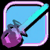 |
| 12 | 3 | Grenade | \#grenade |  |
| 13 | 3 | Remote Detonator | \#bomb |  |
| 14 | 3 | Tear gas | \#teargas |  |
| 15 | 3 | Molotov | \#molotov |  |
| 16 | 3 | Missile | \#missile |  |
| 17 | 4 | Colt \(.45\) | \#colt45 | 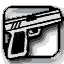 |
| 18 | 4 | Python \(.357\) | \#python |  |
| 19 | 5 | Chrome Shotgun | \#chromegun | 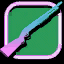 |
| 20 | 5 | S.P.A.S 12 Shotgun | \#shotgspa |  |
| 21 | 5 | Stubby Shotgun | \#buddyshot | 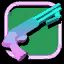 |
| 22 | 6 | Tec-9 | \#tec9 | 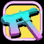 |
| 23 | 6 | Uzi 9mm | \#uzi | 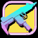 |
| 24 | 6 | Ingram Mac 10 | \#ingramsl | 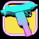 |
| 25 | 6 | MP5 | \#mp5lng | 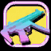 |
| 26 | 7 | M4 | \#m4 | 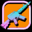 |
| 27 | 7 | Ruger | \#ruger | 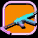 |
| 30 | 8 | Rocket Launcher | \#rocketla | 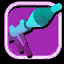 |
| 31 | 8 | Flame Thrower | \#flame | 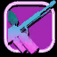 |
| 32 | 8 | M60 | \#M60 | 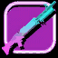 |
| 33 | 8 | Minigun | \#minigun |  |
| 35 | 8 | Helicopter Cannon |  |  |
| 28 | 9 | Sniper Rifle | \#sniper |  |
| 29 | 9 | PSG-1 \(.308 Sniper\) | \#laser | 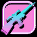 |
| 34 | 10 | Detonator |  |  |
| 36 | 10 | Camera | \#camera |  |

